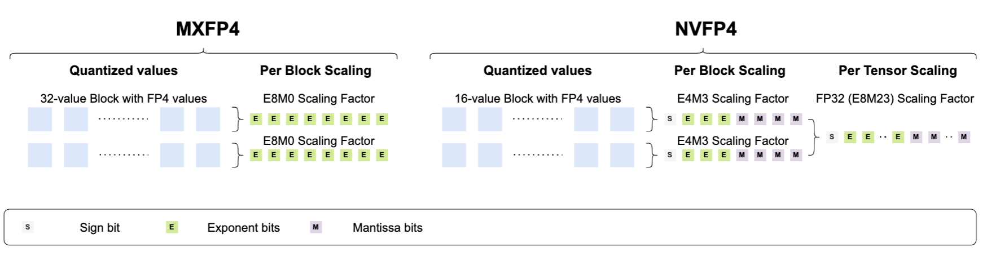
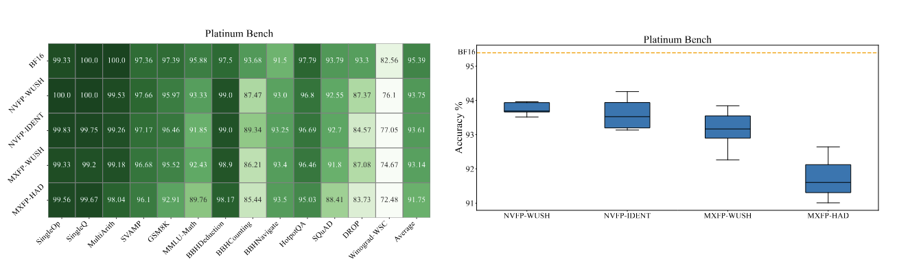
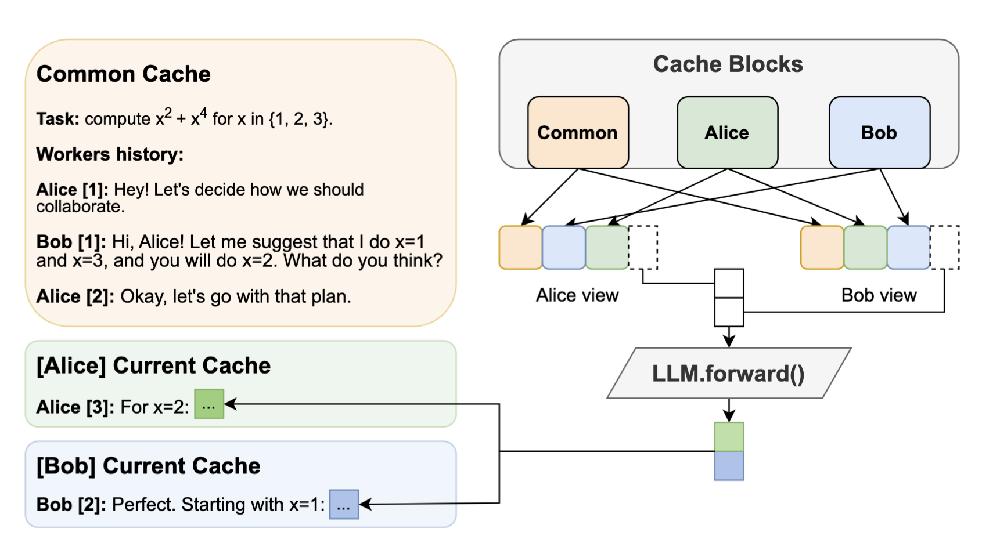
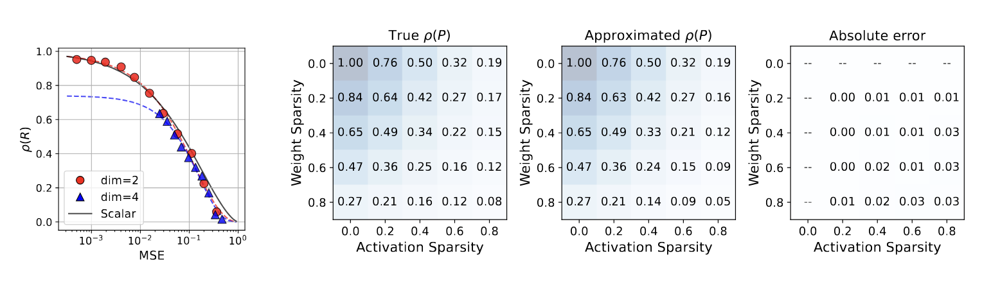
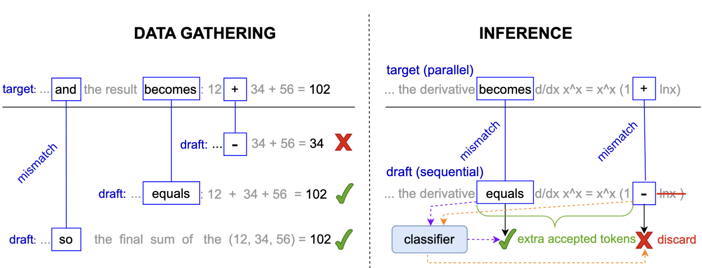
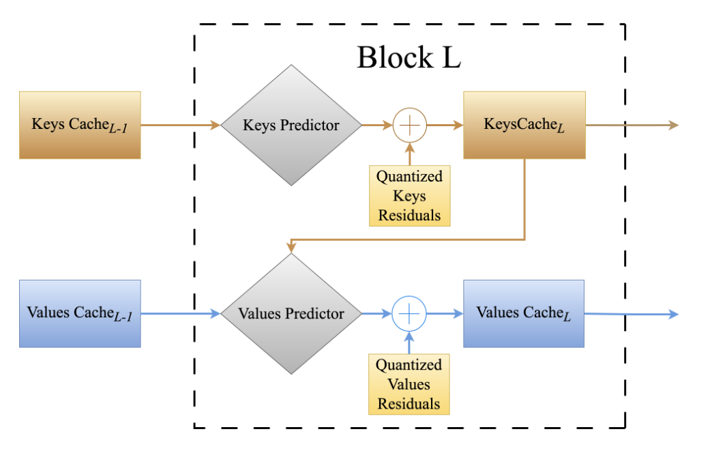
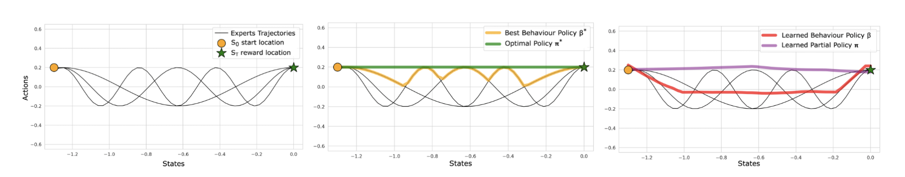

### Papers

[Bridging the Gap Between Promise and Performance for Microscaling FP4 Quantization](https://arxiv.org/abs/2509.23202)  
Vage Egiazarian*, Roberto L Castro*, Denis Kuznedelev*, Andrei Panferov*, Eldar Kurtic, Shubhra Pandit, Alexandre Marques, Mark Kurtz, Saleh Ashkboos, Torsten Hoefler, Dan Alistarh  
[Pre-print]
  
We present the first comprehensive study of MXFP4 and NVFP4 for post-training quantization, revealing gaps between their promise and real-world performance. Our analysis shows that state-of-the-art methods struggle with FP4, due to two key issues: (1) NVFP4's small group size provably neutralizes traditional outlier mitigation techniques; (2) MXFP4's power-of-two scale quantization severely degrades accuracy due to high induced error. To bridge this gap, we introduce Micro-Rotated-GPTQ (MR-GPTQ), a variant of the classic GPTQ quantization algorithm that tailors the quantization process to FP4's unique properties, by using block-wise Hadamard transforms and format-specific optimizations. We support our proposal with a set of high-performance GPU kernels that enable the MR-GPTQ format with negligible overhead, by rotation fusion into the weights, and fast online computation of the activations. This leads to speedups vs. FP16 of up to 3.6x layer-wise, and 2.2x end-to-end on NVIDIA B200, and of 6x layer-wise and 4x end-to-end on RTX5090. 

---

[WUSH: Near-Optimal Adaptive Transforms for LLM Quantization](https://arxiv.org/abs/2512.00956)  
Jiale Chen, Vage Egiazarian, Torsten Hoefler, Dan Alistarh 
[Pre-print]
  
 In this work, we derive, for the first time, closed-form optimal linear blockwise transforms for joint weight-activation quantization using standard data-free quantizers for common numerical formats. Specifically, we provide derivations of the optimal adaptive (data-aware) transforms for round-to-nearest (RTN), AbsMax-scaled block quantizers for both integer and floating-point formats. The resulting construction, which we call WUSH, combines a Hadamard backbone with a data-dependent component based on second-order moments, yielding a non-orthogonal transform that is provably optimal under mild assumptions and remains structured for efficient implementation. Preliminary experimental results show that our approach consistently improves upon the Hadamard transform for common formats.

---

[Hogwild! inference: Parallel llm generation via concurrent attention](https://arxiv.org/abs/2504.06261)  
Gleb Rodionov*, Roman Garipov*, Alina Shutova*, George Yakushev*, Vage Egiazarian, Anton Sinitsin, Denis Kuznedelev, Dan Alistarh   
[NeurIPS Spotlight 2025]
  
 In this work, we propose a different design approach: we run LLM "workers" in parallel , allowing them to synchronize via a concurrently-updated attention cache and prompt these workers to decide how best to collaborate. Our approach allows the LLM instances to come up with their own collaboration strategy for the problem at hand, all the while "seeing" each other's memory in the concurrent KV cache. We implement this approach via Hogwild! Inference: a parallel LLM inference engine where multiple instances of the same LLM run in parallel with the same attention cache, with "instant" access to each other's memory. Hogwild! Inference takes advantage of Rotary Position Embeddings (RoPE) to avoid recomputation while improving parallel hardware utilization. We find that modern reasoning-capable LLMs can perform inference with shared Key-Value cache out of the box, without additional fine-tuning.

---

[Unified Scaling Laws for Compressed Representations](https://arxiv.org/abs/2506.01863)  
Andrei Panferov, Alexandra Volkova, Ionut-Vlad Modoranu, Vage Egiazarian, Mher Safaryan, Dan Alistarh  
[NeurIPS 2025]
  
This paper investigates the interplay between scaling laws and compression formats, exploring whether a unified scaling framework can accurately predict model performance when training occurs over various compressed representations, such as sparse, scalar-quantized, sparse-quantized or even vector-quantized formats. Our key contributions include validating a general scaling law formulation and showing that it is applicable both individually but also composably across compression types. Based on this, our main finding is demonstrating both theoretically and empirically that there exists a simple "capacity" metric -- based on the representation's ability to fit random Gaussian data -- which can robustly predict parameter efficiency across multiple compressed representations.

---

[AutoJudge: Judge Decoding Without Manual Annotation](https://arxiv.org/abs/2504.20039)  
Roman Garipov*, Fedor Velikonivtsev*, Ivan Ermakov, Ruslan Svirschevski, Vage Egiazarian, Max Ryabinin   
[NeurIPS  2025]
  
We introduce AutoJudge, a method that accelerates large language model (LLM) inference with task-specific lossy speculative decoding. Instead of matching the original model output distribution token-by-token, we identify which of the generated tokens affect the downstream quality of the response, relaxing the distribution match guarantee so that the "unimportant" tokens can be generated faster. Our approach relies on a semi-greedy search algorithm to test which of the mismatches between target and draft models should be corrected to preserve quality and which ones may be skipped. We then train a lightweight classifier based on existing LLM embeddings to predict, at inference time, which mismatching tokens can be safely accepted without compromising the final answer quality.

---

[Cache Me If You Must: Adaptive Key-Value Quantization for Large Language Models](https://openreview.net/forum?id=COowwJOAZi)  
Alina Shutova*, Vladimir Malinovskii*, Vage Egiazarian*, Denis Kuznedelev, Denis Mazur, Nikita Surkov, Ivan Ermakov, Dan Alistarh   
[ICML 2025]
  
In this work, we aim to improve Key & Value compression by exploiting two observations: 1) the inherent dependencies between keys and values across different layers, and 2) high-compression mechanisms for internal network states. We propose AQUA-KV, an adaptive quantization for Key-Value caches that relies on compact adapters to exploit existing dependencies between Keys and Values, and aims to "optimally" compress the information that cannot be predicted. AQUA-KV significantly improves compression rates, while maintaining high accuracy on state-of-the-art LLM families. On Llama 3.2 LLMs, we achieve near-lossless inference at 2-2.5 bits per value with under relative error in perplexity and LongBench scores. AQUA-KV is one-shot, simple, and efficient: it can be calibrated on a single GPU within 1-6 hours, even for 70B models.

---

[Rethinking optimal transport in offline reinforcement learning](https://proceedings.neurips.cc/paper_files/paper/2024/hash/df54302388bbc145aacaa1a54a4a5933-Abstract-Conference.html)  
Arip Asadulaev, Rostislav Korst, Aleksandr Korotin, Vage Egiazarian, Andrey Filchenkov, Evgeny Burnaev   
[NeurIPS 2024]
  
We propose a novel algorithm for offline reinforcement learning using optimal transport. Typically, in offline reinforcement learning, the data is provided by various experts and some of them can be sub-optimal. To extract an efficient policy, it is necessary to\emph {stitch} the best behaviors from the dataset. To address this problem, we rethink offline reinforcement learning as an optimal transportation problem. And based on this, we present an algorithm that aims to find a policy that maps states to a\emph {partial} distribution of the best expert actions for each given state. We evaluate the performance of our algorithm on continuous control problems from the D4RL suite and demonstrate improvements over existing methods.

---

[Extreme Compression of Large Language Models via Additive Quantization ](https://arxiv.org/abs/2401.06118)  
Vage Egiazarian*, Andrei Panferov*, Denis Kuznedelev, Elias Frantar, Artem Babenko, Dan Alistarh   
[ICML 2024]
  
In this paper, we revisit the problem of "extreme" LLM compression--defined as targeting extremely low bit counts, such as 2 to 3 bits per parameter, from the point of view of classic methods in Multi-Codebook Quantization (MCQ). Our work builds on top of Additive Quantization, a classic algorithm from the MCQ family, and adapts it to the quantization of language models. The resulting algorithm advances the state-of-the-art in LLM compression, outperforming all recently-proposed techniques in terms of accuracy at a given compression budget.

---

[SpQR: A Sparse-Quantized Representation for Near-Lossless LLM Weight Compression](https://arxiv.org/abs/2306.03078)  
Tim Dettmers*, Ruslan Svirschevski*, Vage Egiazarian*, Denis Kuznedelev*, Elias Frantar, Saleh Ashkboos, Alexander Borzunov, Torsten Hoefler, Dan Alistarh  
[ICLR 2024]  
   
We introduce the Sparse-Quantized Representation (SpQR), a new compressed format and quantization technique which enables for the first time near-lossless compression of LLMs across model scales, while reaching similar compression levels to previous methods. SpQR works by identifying and isolating outlier weights, which cause particularly-large quantization errors, and storing them in higher precision, while compressing all other weights to 3-4 bits, and achieves relative accuracy losses of less than 1% in perplexity for highly-accurate LLaMA and Falcon LLMs. 

---

[Neural Optimal Transport with General Cost Functionals](https://arxiv.org/pdf/2205.15403.pdf)  
Arip Asadulaev*, Alexander Korotin*, Vage Egiazarian,Petr Mokrov, Evgeny Burnaev  
[ICLR 2024]  
  
We present a novel neural-networks-based algorithm to compute optimal transport (OT) plans and maps for general cost functionals. The algorithm is based on a saddle point reformulation of the OT problem and generalizes prior OT methods for weak and strong cost functionals. As an application, we construct a functional to map data distributions with preserving the class-wise structure of data.

---

[DEF: Deep Estimation of Sharp Geometric Features in 3D Shapes](https://arxiv.org/abs/2011.15081)  
Matveev,A., Rakhimov, R., Artemov, A., Bobrovskikh,G., Egiazarian,V., Bogomolov,E., Panozzo,D., Zorin,D., Burnaev,E.   
[SiGGRAPH 2022] 

We propose Deep Estimators of Features (DEFs), a learning-based framework for predicting sharp geometric features in sampled 3D shapes. Differently from existing data-driven methods, which reduce this problem to feature classification, we propose to regress a scalar field representing the distance from point samples to the closest feature line on local patches. We demonstrate a downstream application, where we reconstruct an explicit representation of straight and curved sharp feature lines from range scan data. 

---

[Wasserstein Iterative Networks for Barycenter Estimation](https://arxiv.org/abs/2201.12245)  
Korotin, A., Egiazarian, V., Li, L., Burnaev E.  
[NeurIPS 2022] 

In this paper, we present an algorithm to approximate the Wasserstein-2 barycenters of continuous measures via a generative model. In addition, based on the celebrity faces dataset, we construct Ave, celeba! dataset which can be used for quantitative evaluation of barycenter algorithms. 

---

[Wasserstein-2 Generative Networks](http://adase.group/projects/w2gn/)    
Korotin, A., Egiazarian, V., Asadulaev, A., Burnaev E.    
[ICLR 2021] 

In this paper, we propose a novel end-to-end algorithm for training generative models which optimizes a non-minimax objective simplifying model training. The proposed algorithm uses the approximation of Wasserstein-2 distance by using Input Convex Neural Networks. 

---

[Deep Vectorization of Technical Drawings](http://adase.group/3ddl/projects/vectorization/)  
Egiazarian,V.* , Voynov, O.* , Artemov, A., Volkhonskiy, D., Safin, A., Taktasheva, M., Zorin, D., & Burnaev, E.  
[ECCV 2020] 

We present a new method for vectorization of technical line drawings which consists of (1) a deep learning-based cleaning stage, (2) a transformer-based network to estimate vector primitives, and (3) an optimization procedure to obtain the final primitive configurations. 

---

[Pyramids for Adversarial Representation Learning with 3D Point Clouds](http://adase.group/3ddl/projects/3d-laplatgan/)  
Egiazarian, V.* , Ignatyev, S.* , Artemov, A., Voynov, O., Kravchenko, A., Zheng, Y., Velho,L., Burnaev,E.  
[VISAPP 2020] 

We employ a latent-space Laplacian pyramid representation within a hierarchical generative model for 3D point clouds. We combine recent latent-space GAN and Laplacian GAN to form a multi-scale model for generation of 3D point clouds with gradually increasing levels of detail. 

--- 

[Beyond Vector Spaces: Compact Data Representation as Differentiable Weighted Graphs](https://papers.nips.cc/paper/8914-beyond-vector-spaces-compact-data-representation-as-differentiable-weighted-graphs)  
Denis Mazur*, Vage Egiazarian*, Stanislav Morozov*, Artem Babenko  
[NeuRips 2019] 

In this paper, we aim to eliminate the inductive bias imposed by the embedding space geometry. Namely, we propose to map data into more general non-vector metric spaces: a weighted graph with a shortest path distance. By design, such graphs can model arbitrary geometry with a proper configuration of edges and weights.  

---

[Perceptual deep depth super-resolution](http://adase.group/3ddl/projects/perceptual-depth-sr/)  
Voinov, O., Artemov, A., Egiazarian, V., Notchenko, A., Bobrovskikh, G., Zorin, D., & Burnaev, E.    
[ICCV 2019] 

We address the problem of depth map super-resolution with the focus on visual quality of the corresponding 3D geometry. We demonstrate that basing the loss function on deviation of 3D surface rendering instead of direct depth deviation yields significantly improved results as measured by a number of perceptual metrics. 

---
### Awards
Laureate of  Yandex The Ilya Segalovich Award  2020 for Researchers

---

Page template forked from <a href="https://github.com/evanca/quick-portfolio">evanca</a>.>Hosted on GitHub Pages &mdash; Theme by <a href="https://github.com/orderedlist">orderedlist</a>

<!-- Remove above link if you don't want to attibute -->
